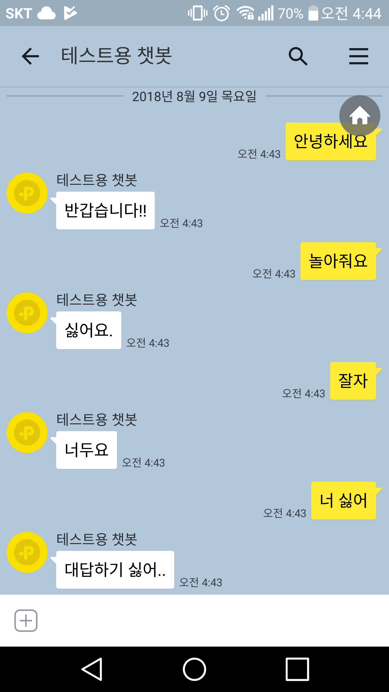

# 간단한 카카오톡 챗봇 

Node.js express를 이용해서 간단히 만든 카카오톡 자동응답 API 챗봇입니다. 
예제를 사용하실 때, 마음껏 사용하셔두 됩니다. 도움이 되셨다면 star 눌러주시면 더더욱 좋구요. 

## 스냅샷

 ### 서버 사이드

 

 정상적으로 API 요청에 따라 데이터를 핸들링하였습니다. 
사용하신다면 소스코드 내의 console.log 부분 위주로 지워주시고 데이터처리 하시면 됩니다.   

### 카카오톡 사용

 POST /message 부분에서 해당 문장에 따라 답변을 하게 처리했습니다.  
다른 방법으로 이용하실려면 이 부분을 고쳐야합니다. 

## Contributing

 컨트리뷰팅은 항상 환영합니다. 그 외에 질문사항이나 더 좋은 방법이 있다면 아래의 메일로 연락주세요.
 - NAVER : beta1360@naver.com
 - G-mail : beta1360sh@gmail.com

 